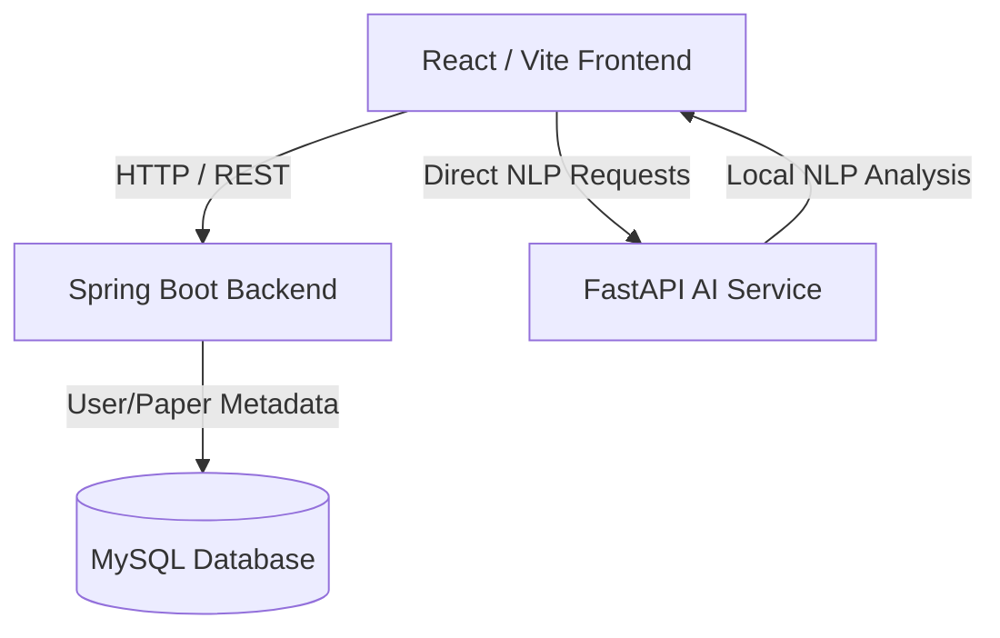

# Local Research AI & Academic Analysis Platform

A modern, full-stack web application designed for academic researchers and students. The platform allows users to upload research papers (PDFs), extract key topics, generate automated short/detailed summaries using local Natural Language Processing (NLP) models, build interactive study flashcards, and chat directly with their documents—all without requiring paid external AI subscriptions or cloud APIs.

---

## 🏗️ System Architecture

The application is structured as a decoupled microservices architecture:



1. **Frontend**: Built with **React**, **Vite**, and **TailwindCSS** for a fast, responsive user interface.
2. **Backend**: Built with **Java Spring Boot**, managing security, JWT-based user authentication, paper uploads, metadata persistence, and project state.
3. **AI Service**: A local Python **FastAPI** microservice utilizing offline NLP libraries to summarize PDFs, extract keywords, and answer user queries.
4. **Database**: **MySQL** for robust relation persistence (users, papers, and metadata).

---

## 💻 System Requirements & Prerequisites

Before starting, ensure your local development machine has the following installed:

*   **Operating System**: Windows 10/11, macOS, or Linux (Command Prompt/CMD steps below are optimized for Windows)
*   **Java Development Kit (JDK)**: JDK 17 or higher
*   **Build Tool**: Maven (installed globally or configured via system path)
*   **Runtime Environment**: Node.js (v18.x or higher) and npm (v9.x or higher)
*   **Python**: Python 3.10 or higher
*   **Database**: MySQL Server 8.0+ running on port `3306`

---

## 🛠️ Step-by-Step Installation & Configuration

### 1. Database Setup (MySQL)
1. Ensure your local MySQL server is running.
2. The Spring Boot backend is configured to automatically create the database `research_db` if it does not exist.
3. Verify your connection credentials inside `backend/src/main/resources/application.properties`:
   ```properties
   spring.datasource.url=jdbc:mysql://localhost:3306/research_db?createDatabaseIfNotExist=true&useSSL=false&serverTimezone=UTC
   spring.datasource.username=root
   spring.datasource.password=123456
   ```
   *Change `spring.datasource.username` and `spring.datasource.password` if your local MySQL database has different credentials.*

---

### 2. Python AI Service Setup (`ai-service`)
The AI service runs inside a Python virtual environment to avoid conflicts with global libraries.

1. Open your Command Prompt (`cmd.exe`) and navigate to the `ai-service` folder:
   ```cmd
   cd ai-service
   ```
2. **Create a Virtual Environment** (if not already created):
   ```cmd
   python -m venv venv
   ```
3. **Activate the Virtual Environment**:
   ```cmd
   venv\Scripts\activate.bat
   ```
   *(You will see `(venv)` prepended to your command line indicating successful activation).*
4. **Install Dependencies**:
   Run the following command to download and install all required NLP and API packages:
   ```cmd
   pip install fastapi uvicorn pydantic PyPDF2 sumy yake textstat nltk
   ```
5. **Download NLTK NLP Data Models** (Required for sentence tokenization and summarization):
   While the virtual environment is active, execute this quick download script:
   ```cmd
   python -c "import nltk; nltk.download('punkt'); nltk.download('punkt_tab')"
   ```

---

### 3. Java Spring Boot Backend Setup (`backend`)
1. Open a new Command Prompt window and navigate to the `backend` folder:
   ```cmd
   cd backend
   ```
2. Build the project and download all Maven dependencies:
   ```cmd
   mvn clean install
   ```

---

### 4. React Frontend Setup (`frontend`)
1. Open another Command Prompt window and navigate to the `frontend` folder:
   ```cmd
   cd frontend
   ```
2. Install all required Node.js libraries and UI packages:
   ```cmd
   npm install
   ```

---

## 🚀 How to Run the Application Step-by-Step

To run the complete application, you will need to open **four separate Command Prompt (`cmd.exe`) windows** (one for each microservice). Follow these commands:

### 🟢 Terminal 1: Run the Database

```cmd
mysql -u root -p

```
(Enter your password ( same as applicatio.properties ) )
### 🟢 Terminal 2: Run the Backend
```cmd
cd backend
mvn spring-boot:run
```
*Runs on [http://localhost:8080](http://localhost:8080)*

### 🟢 Terminal 3: Run the Python AI Service
```cmd
cd ai-service
venv\Scripts\activate.bat
python main.py
```
*Runs on [http://localhost:8000](http://localhost:8000)*

### 🟢 Terminal 4: Run the React Frontend
```cmd
cd frontend
npm run dev
```
*Runs on [http://localhost:5173](http://localhost:5173)*


---

## 🔍 Verifying the Setup

1. **Access the Frontend Application**:  
   Open your browser and navigate to: **[http://localhost:5173](http://localhost:5173)**. You can now register and log in using your preferred credentials (e.g., student, researcher, or admin).
2. **Access the Backend API**:  
   Verify that your Spring Boot backend is healthy by checking [http://localhost:8080](http://localhost:8080).
3. **Explore the AI API Documentation**:  
   Open **[http://localhost:8000/docs](http://localhost:8000/docs)** to access the interactive FastAPI Swagger UI. You can test processing PDFs and query-handling directly.

---


## 📦 Installed Python Libraries Description

Here are the key Python packages used to run the offline AI analysis:
*   **FastAPI / Uvicorn**: High-performance asynchronous web framework and server to expose endpoints.
*   **PyPDF2**: Local, robust PDF processing library to read and extract text from uploaded research papers.
*   **Sumy**: Library for extracting text summaries using automated algorithmic methods (LexRank model).
*   **Yake**: A lightweight, unsupervised keyword extraction system to identify key topics.
*   **Textstat**: Analysis utility to calculate readability and reading level complexity scores of the papers.
*   **NLTK**: Natural Language Toolkit, utilized here for sentence and keyword tokenization.
